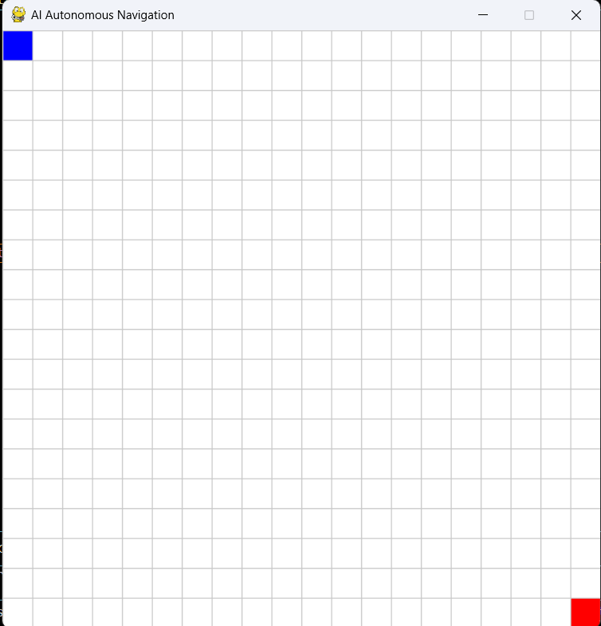

# 🚗 AI-Based Autonomous Navigation System

🚀 A simulation of autonomous robot navigation using A* path planning with dynamic obstacle handling.

---

## 📌 Project Overview

This project simulates an AI-based autonomous navigation system in a 2D grid environment, where a robot intelligently navigates from a user-defined start point to a destination while avoiding obstacles.

The system leverages the A* (A-Star) path planning algorithm to compute the shortest optimal path and dynamically adapts to generated environments.

This project reflects real-world applications such as:
- Self-driving vehicles  
- Warehouse automation  
- Robotics navigation systems  
- Delivery route optimization  

---

## 🎯 Objective

- Enable autonomous navigation in a virtual environment  
- Compute optimal path using heuristic-based search (A*)  
- Avoid obstacles efficiently  
- Provide an interactive simulation for real-time visualization  

---

## 🧠 Technologies Used

- Python  
- Pygame  
- A* Algorithm  

---

## 🏗️ System Architecture

1. Environment Setup  
   - Grid-based map generation (20x20)  

2. User Input Module  
   - Start and End node selection  

3. Obstacle Handling  
   - Manual placement  
   - Automatic obstacle generation  

4. Path Planning Engine  
   - A* algorithm computes shortest path  

5. Execution Engine  
   - Robot follows computed path step-by-step  

---

## ⚡ Key Features

- User-defined Start and End points  
- Manual obstacle creation and removal  
- Automatic obstacle generation (press G)  
- Guaranteed valid path before simulation  
- Real-time path visualization  
- Step-by-step robot movement  
- Interactive controls  

## 📂 Project Structure

    AI-Based-Autonomous-Navigation-System/
    ├── src/
    │   ├── main.py
    │   ├── simulation.py
    │   └── path_planning.py
    ├── images/
    ├── demo/
    ├── README.md
    └── requirements.txt

## ⚙️ Installation

pip install pygame

---

## ▶️ How to Run

python src/main.py

---

## 🎮 Controls

| Action               | Key / Input |
|---------------------|------------|
| Set Start Point     | S + Click  |
| Set End Point       | E + Click  |
| Generate Obstacles  | G          |
| Add Obstacle        | Left Click |
| Remove Obstacle     | Right Click|
| Start Simulation    | SPACE      |
| Reset Grid          | R          |

---

## 🔄 Working Flow

1. Set Start (S) and End (E)  
2. Press G to generate obstacles  
3. System ensures a valid path using A*  
4. Press SPACE to start robot movement  

---

## 🧮 Algorithm Used: A* (A-Star)

f(n) = g(n) + h(n)

Where:
- g(n) = cost from start to current node  
- h(n) = heuristic (Manhattan distance)  
- f(n) = total estimated cost  

- Guarantees shortest path  
- Efficient and widely used in robotics and AI  

---

## 📸 Output Screenshots

  
  
  
  

---

## 🎥 Demo Video

👉 [Watch Demo](./demo/demo.mp4)

---

## 🚀 Future Enhancements

- Dynamic obstacle movement  
- OpenCV integration  
- YOLO-based object detection  
- CARLA simulator integration  
- Reinforcement learning  

---

## 💡 Learning Outcomes

- A* path planning algorithm  
- Autonomous navigation concepts  
- Simulation development  
- Real-time decision making  

---

## 👩‍💻 Author

Swetha K
