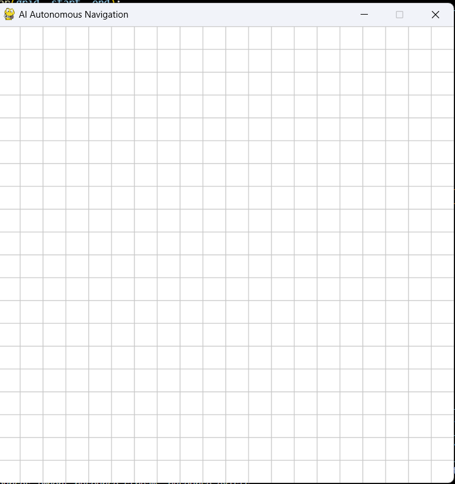
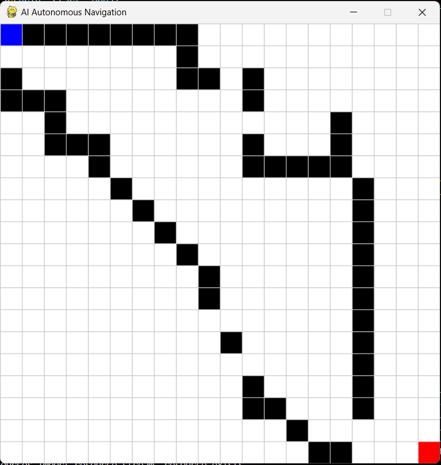
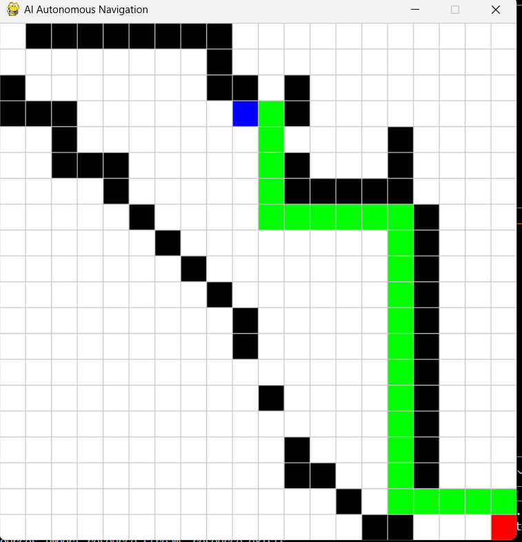

# 🚀 AI-Based Autonomous Navigation System

## 📌 Project Overview

This project simulates an AI-based autonomous navigation system where a robot intelligently moves from a start point to a destination while avoiding obstacles using the A* path planning algorithm.

The system demonstrates core concepts of robotics and autonomous systems such as path planning, obstacle avoidance, and simulation-based navigation.

---

## 🎯 Objective
To simulate how autonomous robots and self-driving systems make navigation decisions without human intervention.

---

## 🌍 Industry Relevance
Used in:
- Self-driving cars (Tesla, Waymo)
- Warehouse robots
- Delivery robots
- Drones
- Industrial automation

---

## ✨ Features

- Interactive grid-based simulation
- A* path planning algorithm implementation
- Dynamic obstacle placement
- Real-time robot movement visualization
- Start and end point selection
- Keyboard-based control system
- Clean modular Python code structure
---

## 🛠️ Tech Stack
- Python  
- Pygame  
- A* Algorithm  

---

## 🧠 Architecture

User Input → Grid → Path Planning → Robot Movement → Visualization

---

## 📂 Project Structure
demo/demo.mp4
images/
main.py
simulation.py
path_planning.py
README.md
requirements.txt

---

## ▶️ How to Run

1. Clone the repository:
git clone https://github.com/Swetha07062003/AI-Autonomous-Navigation-System-

2. Navigate to the project:
cd AI-Autonomous-Navigation-System

3. Install dependencies:
pip install pygame

4. Run the project:
python src/main.py

## 🎮 Controls

- S → Start  
- E → End  
- SPACE → Move  
- Left Click → Add obstacle  
- Right Click → Remove obstacle  
- R → Reset  
- G → Auto obstacles  
- P → Save output  

---

## 🎥 Demo Video

▶️ Click below to watch the project demo:

[Watch Demo Video](demo/demo.mp4)
---

## 📸 Screenshots

### 🧱 Grid Setup

### 🚧 Obstacles Placement

### 🧠 Path Planning (A*)

<<<<<<< HEAD
=======

>>>>>>> 4571341f5bd424a606d947cb8058791dd7f150e3
---

## 🚀 Future Improvements

- 🔹 Real-time camera integration using OpenCV for live obstacle detection
- 🔹 Implementation of YOLO-based object detection for dynamic environments
- 🔹 Integration with ROS (Robot Operating System) for real robotic applications
- 🔹 Upgrade from 2D grid simulation to 3D simulation using CARLA or Gazebo
- 🔹 Implementation of Reinforcement Learning for adaptive navigation
- 🔹 Multi-agent navigation system (multiple robots coordination)
- 🔹 Path optimization using Dijkstra and Hybrid A* algorithms
- 🔹 Deployment on Raspberry Pi / Jetson Nano with real hardware

---

## 👩‍💻 Author
<<<<<<< HEAD
Swetha K
=======
Swetha K
>>>>>>> 4571341f5bd424a606d947cb8058791dd7f150e3
