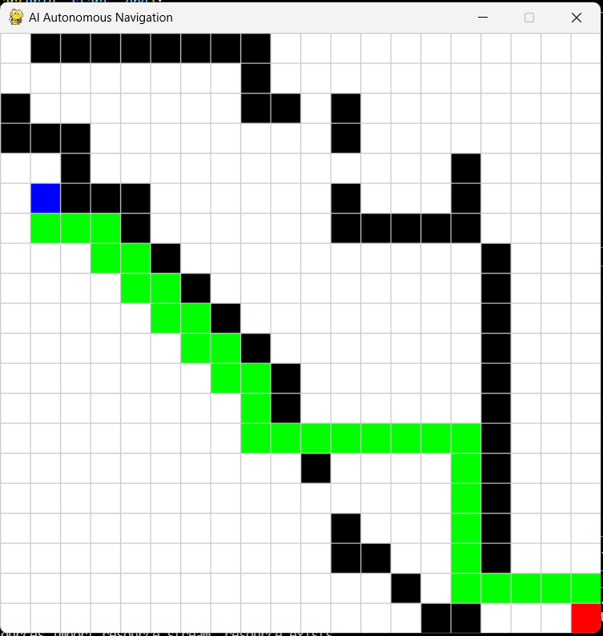
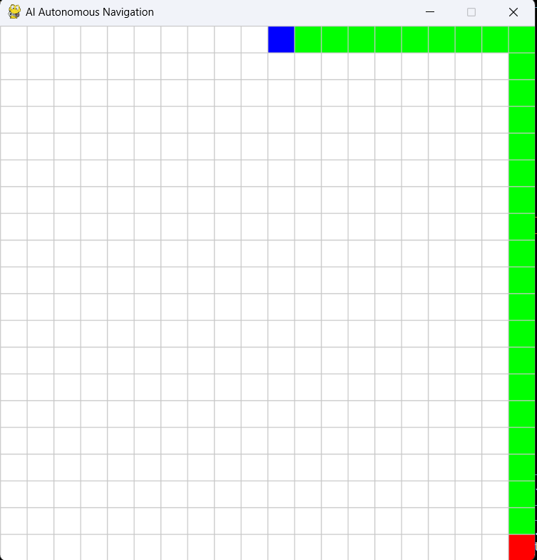

# 🚀 AI-Based Autonomous Navigation System

## 📌 Project Overview

This project demonstrates an AI-based navigation system where a virtual robot moves from a start point to a destination while avoiding obstacles using intelligent path planning.

---

## 🎯 Objective

To simulate how autonomous robots and vehicles navigate safely without human control.

---

## 🌍 Industry Relevance

This system is similar to technologies used in:

* Self-driving cars
* Warehouse robots (Amazon)
* Delivery robots
* Drone navigation systems

---

## 🧠 Key Features

* Interactive grid simulation
* Start & End point selection
* Obstacle placement/removal
* A* path planning algorithm
* Real-time robot movement

---

## 🛠️ Tech Stack

* Python
* Pygame
* A* Algorithm

---

## 🏗️ Architecture

User Input → Grid → Obstacles → Path Planning (A*) → Robot Movement

---

## 📂 Folder Structure

AI-Autonomous-Navigation-System/
│
├── images/
├── main.py
├── simulation.py
├── path_planning.py
├── README.md

---

## ⚙️ Installation

Install pygame:

pip install pygame

---

## ▶️ How to Run

python main.py

---

## 🎮 Controls

| Action          | Key         |
| --------------- | ----------- |
| Select Start    | S           |
| Select End      | E           |
| Start Robot     | SPACE       |
| Add Obstacle    | Left Click  |
| Remove Obstacle | Right Click |
| Reset           | R           |

---

## 📸 Screenshots

### Grid

### Start and End

### Obstacles

### Path

---

## 📊 Results

* Robot successfully finds shortest path
* Avoids obstacles correctly
* Demonstrates real-world navigation logic

---

## 🔮 Future Enhancements

* Add camera-based obstacle detection using OpenCV
* Integrate YOLO for object detection
* Implement real robot using Raspberry Pi
* Add multi-agent (multiple robots) system
* Integrate with ROS or CARLA simulator

---

## 🎓 Learning Outcomes

* Understanding of A* path planning algorithm
* Basics of autonomous navigation systems
* Hands-on experience with Python simulation
* Problem-solving using grid-based logic

---

## 👩‍💻 Author

Swetha K
